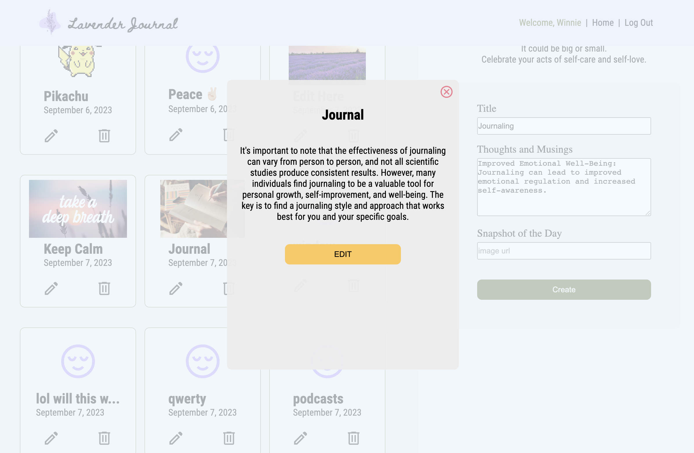

# MERN CRUD FINAL PROJECT - PER SCHOLAS
## Lavender Journal
###### Deployed App: [Lavender Journal](https://lavender-5ryg.onrender.com)

     The "Lavender Journal" is a beautifully designed self-care and gratitude journal that embraces the calming and soothing qualities associated with the scent of lavender.  
     This journal is more than just a diary; it's your daily companion on a journey to improved well-being and mindfulness.

##### [Figma Documentation](https://www.figma.com/file/iSIVMasiwLn42Cf8AQHwz6/Lavender-Journal?type=whiteboard&node-id=3%3A582&t=P9L3F9C3SUyXtAFf-1)

#### Images

##### User Flow & ERD

    

    A user can:
    

    <ul>
        <li>Sign in / Register an Account</li>
        <li>Create a new journal entry</li>
        <li>Read an entry</li>
        <li>Update an entry</li>
        <li>Delete an entry</li>
    </ul>

##### Tech Stack
<ul>
    <li>MongoDB</li>
    <li>Express</li>
    <li>React.js</li>
    <li>Node.js</li>
    <li>CSS</li>
</ul>

##### ICEBOX 🧊
- [ ] Mood/Vision Board with draggable components  
- [ ] Sort, Search, and Filter through Entries  
- [ ] Community - Able to share entries, shareable boards  
- [ ] Edit and Delete Account  